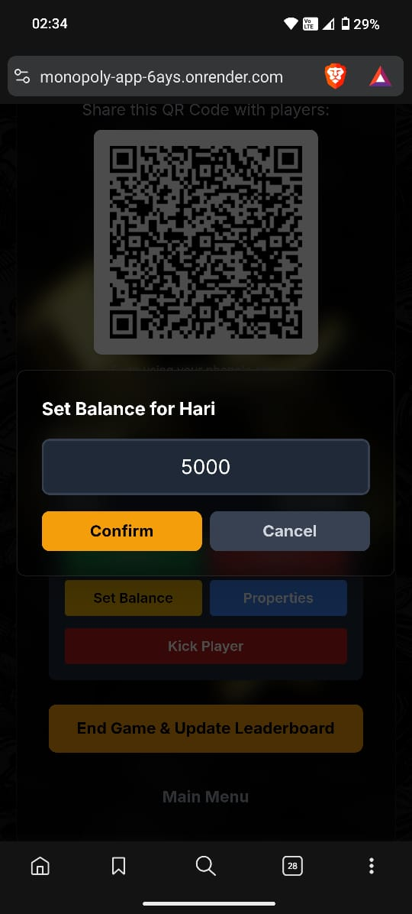

# Monopoly Dealings: A Web-Based Game Companion

Monopoly Dealings is a modern, web-based companion app designed to streamline your Monopoly board game sessions. It replaces physical cash and property cards with a real-time, digital interface, allowing one player to act as the banker (Organizer) while others manage their assets from their own devices.

This project leverages Node.js for a secure backend and Google Firebase for real-time data synchronization.


## ✨ Features

The application is split into two primary roles: the Organizer and the Player.

### Organizer Features (The Banker 🏦)
* **Secure Game Creation:** Create a new game session, protected by a server-validated password. 

* **QR Code Sharing:** Instantly share the game with players via a unique QR code. 
* **Real-Time Dashboard:** View all joined players, their current cash balance, and a list of their owned properties at a glance.  
  
* **Full Banker Controls:**
    * **Add/Take Money:** Easily add or subtract cash from any player's balance.
    * **Set Balance:** Directly set a player's cash to a specific amount.  
      
    * **Manage Properties:** Assign or remove properties for any player.  
       
    * **Kick Player:** Remove a player from the game session.
* **Game Finalization:** End the game to automatically calculate each player's net worth and update the Global Leaderboard.

### Player Features (The Tycoons 🎩)
* **Effortless Joining:** Join a game by simply scanning the QR code or entering the Game ID.  
* **Personal Digital Wallet:** See your name, current cash balance, and owned properties on a sleek, personal card. <br>
 
* **Live Updates:** Your balance and property list update instantly as the Organizer makes changes.
* **Session Persistence:** If you accidentally refresh the page, you'll be automatically reconnected to the game.
* **Glowing Name Effect:** A fun visual flair to make your player card stand out.

### Global Features
* **Global Leaderboard:** A persistent leaderboard that tracks players' cumulative net worth across all games.  
  
* **Dynamic Titles:** The leaderboard awards special glowing titles to the top 3 players (**God of Wealth**, **Fortune Favoured**, **Tycoon**) and, in larger games, to the bottom 3 players (**God of Poverty**, **Unlucky Soul**, **Broke Man**).
* **Secure Backend:** Firebase keys and the organizer password are kept secure on the server and are not exposed to the client.

---

## 🛠️ Technology Stack

* **Frontend:** HTML5, Tailwind CSS, Vanilla JavaScript (ES Modules)
* **Backend:** Node.js, Express.js
* **Database:** Google Firebase (Firestore) for real-time data storage.
* **Deployment:** Can be deployed on any service that supports Node.js (like Heroku, Vercel, Render, etc.).

---

## 🚀 Getting Started

Follow these instructions to get a copy of the project up and running on your local machine.

### Prerequisites

You must have [Node.js](https://nodejs.org/) (which includes npm) installed on your system.

### Installation & Setup

1.  **Clone the repository:**
    ```sh
    git clone <your-repository-url>
    cd monopoly-event
    ```

2.  **Create a `public` directory:**
    The `server.js` file is configured to serve static files from a `public` folder.
    ```sh
    mkdir public
    ```
    Now, **move the `index.html` file inside the new `public` directory.**

3.  **Install dependencies:**
    This will install Express.js, as defined in `package.json`.
    ```sh
    npm install
    ```

4.  **Create an Environment Variables file:**
    Create a file named `.env` in the root of the project. This is where you will store your secret keys and password.

5.  **Populate the `.env` file:**
    Add your Firebase project configuration and a secure organizer password to the `.env` file. The server (`server.js`) will use these variables.

    ```env
    # Firebase Configuration
    FIREBASE_API_KEY="AIzaSy..."
    FIREBASE_AUTH_DOMAIN="your-project.firebaseapp.com"
    FIREBASE_PROJECT_ID="your-project-id"
    FIREBASE_STORAGE_BUCKET="your-project.appspot.com"
    FIREBASE_MESSAGING_SENDER_ID="123456789"
    FIREBASE_APP_ID="1:12345:web:abcdef"
    FIREBASE_MEASUREMENT_ID="G-ABCDEF"

    # Organizer Password
    ORGANIZER_PASSWORD="a-very-secret-password"

    # Server Port (Optional)
    PORT=10000
    ```

### Running the Application

1.  **Start the server:**
    This command executes `server.js` using Node.
    ```sh
    npm start
    ```

2.  **Open the app:**
    You should see a confirmation in your terminal: `✅ Server running on 10000`.
    Open your web browser and navigate to `http://localhost:10000`.

---
